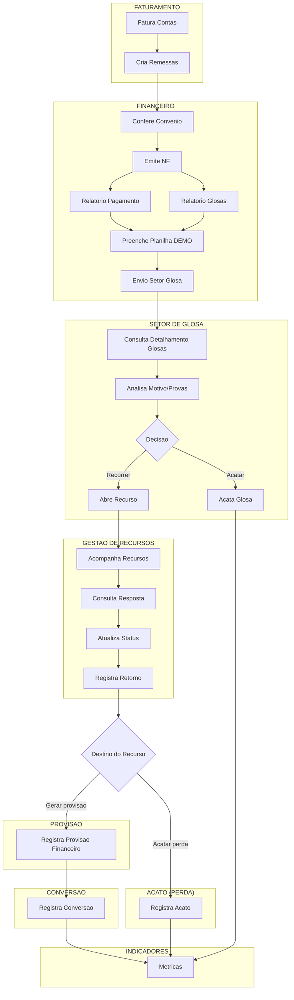

# Sistema de Gestao de Glosas Hospitalares

Plataforma corporativa para gerir o ciclo completo de glosas hospitalares a partir da conta faturada do ERP MV, consultada pela view Oracle `HPC_V_CONTA_ATENDIMENTO`.

## Arquitetura

```text
Oracle MV
  -> View HPC_V_CONTA_ATENDIMENTO
  -> API unica existente
  -> Django Frontend
```

## Regra fundamental

A origem do processo nao e a glosa. A origem e a conta hospitalar faturada. Toda glosa nasce de uma remessa, conta, atendimento ou item faturado retornado pela consulta Oracle.

## Como executar em producao

Configure `API_BASE_URL` apontando para a API unica.

- API no mesmo host, fora do Docker: `API_BASE_URL=http://host.docker.internal:8000`
- API publicada em rede/HTTPS: `API_BASE_URL=https://api.seudominio.com.br`

Se a API exigir autenticacao, informe um token Bearer:

```bash
export API_BEARER_TOKEN="seu-token"
```

Para a consulta de atendimento, o frontend usa por padrao a rota ja publicada na API atual:

```bash
API_CONTA_ATENDIMENTO_PATH=/app_glosas/
```

```bash
cp .env.example .env
# edite DJANGO_SECRET_KEY, DJANGO_ALLOWED_HOSTS, DJANGO_CSRF_TRUSTED_ORIGINS e API_BASE_URL
docker compose up --build -d
docker compose logs -f frontend
```

Servicos:

- Frontend Django: http://localhost:8080 por padrao, ou no proxy reverso configurado.
- Banco SQLite de sessao/autenticacao: volume Docker `frontend_data`.

Para uso local sem HTTPS, ajuste temporariamente `SESSION_COOKIE_SECURE=0` e `CSRF_COOKIE_SECURE=0` no `.env`. Em producao com proxy HTTPS, mantenha ambos como `1`.

## Modal de reCAPTCHA do SPU

Quando as DAGs `extracao_processos_virtuais_spu` ou
`extracao_relatorios_tramitando_spu` encontram a sessão expirada, o Receita
Certa abre automaticamente um modal na tela do usuário logado. O login e a
senha do SPU já estarão preenchidos; o usuário resolve o reCAPTCHA e clica em
**Entrar**. O modal fecha quando a tarefa retoma a extração e também pode ser
minimizado durante a espera.

O frontend encaminha os arquivos do noVNC e o WebSocket apenas depois de
validar a sessão do Receita Certa. Para ligar os projetos no mesmo host Docker:

```bash
docker network create receita_certa_automation
```

Nos `.env` de `prj_web_nfs` e `prj_glosas`, use a mesma senha VNC de exatamente
oito caracteres. No frontend, configure:

```bash
RECEITA_CERTA_AUTOMATION_NETWORK=receita_certa_automation
SPU_NOVNC_INTERNAL_URL=http://spu-novnc:6080
RECEITA_CERTA_SPU_NOVNC_PASSWORD=TROQUE12
SPU_RECAPTCHA_POLL_SECONDS=5
```

Quando o Airflow estiver em outro host, configure
`SPU_NOVNC_INTERNAL_URL=http://IP_PRIVADO_DO_AIRFLOW:6080`. No servidor
Airflow, publique essa porta apenas no IP privado e restrinja no firewall a
origem ao IP privado do servidor do Receita Certa.

O valor é entregue automaticamente ao cliente no fragmento da URL do iframe;
por isso o usuário não vê prompt de senha VNC. O frontend roda como ASGI para
encaminhar o WebSocket. No cenário de mesmo host, a porta 6080 permanece presa
ao loopback; entre hosts, ela fica limitada à rede privada e ao firewall.

## Modulos incluidos

- Consulta de contas/atendimentos via API unica
- Registro de glosas a partir da conta faturada
- Recursos
- Remessas
- Recebimentos financeiros
- Conciliacao e divergencias
- Dashboard de indicadores
- Historico/auditoria

## Endpoints esperados na API unica

- `GET /app_glosas/` com filtros `offset`, `limit`, `cd_remessa`, `cd_atendimento`, `cd_reg`, `nr_guia`, `cd_senha`, `nm_paciente`, `nm_convenio`, `descricao` e `tp_atendimento`
- `POST /app_glosas/glosas`
- `GET /glosas`
- `GET /glosas/{id}`
- `PATCH /glosas/{id}`
- `DELETE /glosas/{id}`
- `POST /recursos`
- `GET /recursos`
- `GET /recursos/{id}`
- `PATCH /recursos/{id}`
- `GET /remessas/{id}`
- `POST /remessas`
- `POST /recebimentos`
- `GET /recebimentos`
- `PATCH /recebimentos/{id}`
- `POST /conciliacao/executar`
- `GET /conciliacao/divergencias`
- `GET /dashboard/indicadores`
- `GET /glosas/{id}/historico`

## Decisoes de implementacao

- O Django nao consulta nem grava diretamente no PostgreSQL.
- O Django consome apenas a API HTTP configurada em `API_BASE_URL`.
- Nao ha upload de planilhas, pandas, openpyxl, ETL ou importadores.
- Os endpoints foram preparados no frontend como se ja existissem na API unica.

## Fluxo operacional de glosas


